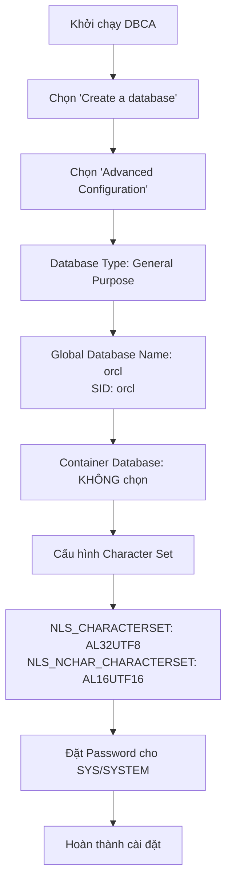
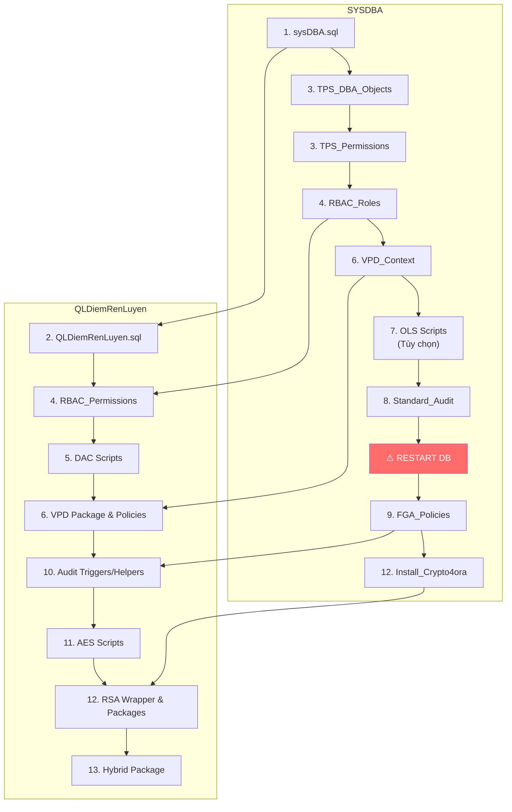

# 🛠️ Hướng Dẫn Tạo Database Oracle 19c Enterprise Edition

## Quản Lý Điểm Rèn Luyện - Database Setup Guide

---

## 📋 Mục Lục

1. [Yêu Cầu Hệ Thống](#-yêu-cầu-hệ-thống)
2. [Bước 1: Tạo Database với DBCA](#-bước-1-tạo-database-với-dbca)
3. [Bước 2: Chạy Script Thiết Lập](#-bước-2-chạy-script-thiết-lập)
4. [Thứ Tự Chạy Script Chi Tiết](#-thứ-tự-chạy-script-chi-tiết)
5. [Xác Minh Cài Đặt](#-xác-minh-cài-đặt)
6. [Xử Lý Sự Cố](#-xử-lý-sự-cố)

---

## 📦 Yêu Cầu Hệ Thống

| Thành Phần             | Yêu Cầu                             |
| ---------------------- | ----------------------------------- |
| Oracle Database        | 19c Enterprise Edition              |
| NLS_CHARACTERSET       | **AL32UTF8**                        |
| NLS_NCHAR_CHARACTERSET | **AL16UTF16**                       |
| RAM tối thiểu          | 4GB                                 |
| Disk Space             | 10GB trống                          |
| Oracle JVM             | Bắt buộc (cho tính năng RSA/Crypto) |

---

## 🔧 Bước 1: Tạo Database với DBCA

### 1.1 Khởi Chạy DBCA

1. Mở **Command Prompt** với quyền **Administrator**
2. Chạy lệnh:

```cmd
dbca
```

### 1.2 Cấu Hình Database



### 1.3 Cấu Hình Character Set Chi Tiết

> [!IMPORTANT] > **Bắt buộc** chọn đúng Character Set để hỗ trợ tiếng Việt!

Trong bước **Character sets**, chọn:

| Thuộc Tính             | Giá Trị       |
| ---------------------- | ------------- |
| Database Character Set | **AL32UTF8**  |
| National Character Set | **AL16UTF16** |

### 1.4 Kiểm Tra Sau Khi Tạo

Mở SQL\*Plus và kết nối:

```sql
sqlplus sys/password@orcl as sysdba
```

Kiểm tra character set:

```sql
SELECT * FROM NLS_DATABASE_PARAMETERS
WHERE PARAMETER IN ('NLS_CHARACTERSET', 'NLS_NCHAR_CHARACTERSET');
```

**Kết quả mong đợi:**

| PARAMETER              | VALUE     |
| ---------------------- | --------- |
| NLS_CHARACTERSET       | AL32UTF8  |
| NLS_NCHAR_CHARACTERSET | AL16UTF16 |

---

## 📝 Bước 2: Chạy Script Thiết Lập

### Cách Kết Nối Database

**Kết nối với SYSDBA:**

```sql
sqlplus sys/password@orcl as sysdba
```

**Kết nối với QLDiemRenLuyen (sau khi tạo user):**

```sql
sqlplus QLDiemRenLuyen/123@orcl
```

### Cách Chạy Script

**Từ SQL\*Plus:**

```sql
@D:\DevTools\projects\QuanLyDiemRenLuyen\QuanLyDiemRenLuyen\Database\script_name.sql
```

**Hoặc sử dụng đường dẫn tương đối:**

```sql
@script_name.sql
```

---

## 📑 Thứ Tự Chạy Script Chi Tiết

> [!CAUTION] > **Tuân thủ đúng thứ tự!** Một số script phụ thuộc vào script trước đó.

---

### 🔹 GIAI ĐOẠN 1: Thiết Lập Cơ Bản (SYSDBA)

| #   | Script       | Chạy Với   | Mô Tả                                       |
| --- | ------------ | ---------- | ------------------------------------------- |
| 1.1 | `sysDBA.sql` | **SYSDBA** | Tạo user QLDiemRenLuyen và cấp quyền cơ bản |

```sql
-- Kết nối SYSDBA
sqlplus sys/password@orcl as sysdba

-- Chạy script
@sysDBA.sql
```

**Kết quả mong đợi:**

- ✓ User `QLDiemRenLuyen` được tạo với password `123`
- ✓ Quyền CONNECT, RESOURCE được cấp
- ✓ Quyền EXECUTE trên DBMS_CRYPTO, UTL_RAW được cấp

---

### 🔹 GIAI ĐOẠN 2: Tạo Schema (QLDiemRenLuyen)

| #   | Script               | Chạy Với           | Mô Tả                                     |
| --- | -------------------- | ------------------ | ----------------------------------------- |
| 2.1 | `QLDiemRenLuyen.sql` | **QLDiemRenLuyen** | Tạo tất cả các bảng, constraints, indexes |

```sql
-- Kết nối với user vừa tạo
sqlplus QLDiemRenLuyen/123@orcl

-- Chạy script
@QLDiemRenLuyen.sql
```

**Danh sách 22 bảng được tạo:**

| #   | Tên Bảng                   | Mô Tả                    |
| --- | -------------------------- | ------------------------ |
| 1   | ENCRYPTION_KEYS            | Khóa mã hóa RSA + AES    |
| 2   | USERS                      | Người dùng hệ thống      |
| 3   | AUDIT_EVENTS               | Nhật ký hệ thống         |
| 4   | PASSWORD_RESET_TOKENS      | Token khôi phục mật khẩu |
| 5   | SESSION_TOKENS             | Token phiên mã hóa AES   |
| 6   | DEPARTMENTS                | Khoa                     |
| 7   | CLASSES                    | Lớp                      |
| 8   | STUDENTS                   | Hồ sơ sinh viên          |
| 9   | TERMS                      | Học kỳ / năm học         |
| 10  | ACTIVITIES                 | Hoạt động                |
| 11  | REGISTRATIONS              | Đăng ký hoạt động        |
| 12  | NOTIFICATIONS              | Thông báo                |
| 13  | NOTIFICATION_READS         | Đã đọc thông báo         |
| 14  | SCORES                     | Điểm rèn luyện           |
| 15  | SCORE_AUDIT_SIGNATURES     | Chữ ký số cho điểm       |
| 16  | PROOFS                     | Minh chứng               |
| 17  | FEEDBACKS                  | Phản hồi                 |
| 18  | FEEDBACK_ATTACHMENTS       | File đính kèm phản hồi   |
| 19  | CLASS_LECTURER_ASSIGNMENTS | Phân công CVHT           |
| 20  | AUDIT_CHANGE_LOGS          | Log thay đổi dữ liệu     |
| 21  | AUDIT_CONFIG               | Cấu hình audit           |
| 22  | CLASS_SCORE_PERMISSIONS    | Phân quyền xem điểm      |

---

### 🔹 GIAI ĐOẠN 3: Tablespace, Profile & Session (SYSDBA)

| #   | Script                                                      | Chạy Với   | Mô Tả                           |
| --- | ----------------------------------------------------------- | ---------- | ------------------------------- |
| 3.1 | `Tablespace_Profile_Session/001_TPS_DBA_Objects_SYSDBA.sql` | **SYSDBA** | Tạo Views và Procedures quản lý |
| 3.2 | `Tablespace_Profile_Session/002_TPS_Permissions_SYSDBA.sql` | **SYSDBA** | Cấp quyền thực thi              |

```sql
-- Kết nối SYSDBA
sqlplus sys/password@orcl as sysdba

-- Chạy script
@Tablespace_Profile_Session/001_TPS_DBA_Objects_SYSDBA.sql
@Tablespace_Profile_Session/002_TPS_Permissions_SYSDBA.sql
```

**Objects được tạo:**

- `SYS.V_TABLESPACE_USAGE` - View theo dõi tablespace
- `SYS.V_USER_PROFILES` - View quản lý profiles
- `SYS.V_ACTIVE_SESSIONS` - View sessions đang hoạt động
- `QLDiemRenLuyen.SP_CREATE_USER_PROFILE` - Procedure tạo profile
- `QLDiemRenLuyen.SP_KILL_USER_SESSION` - Procedure kill session

---

### 🔹 GIAI ĐOẠN 4: RBAC - Role-Based Access Control

| #   | Script                                         | Chạy Với           | Mô Tả                      |
| --- | ---------------------------------------------- | ------------------ | -------------------------- |
| 4.1 | `RBAC/001_RBAC_Roles_SYSDBA.sql`               | **SYSDBA**         | Tạo 4 database roles       |
| 4.2 | `RBAC/002_RBAC_Permissions_QLDiemRenLuyen.sql` | **QLDiemRenLuyen** | Cấp quyền object cho roles |

```sql
-- BƯỚC 1: Kết nối SYSDBA
sqlplus sys/password@orcl as sysdba
@RBAC/001_RBAC_Roles_SYSDBA.sql

-- BƯỚC 2: Kết nối QLDiemRenLuyen
sqlplus QLDiemRenLuyen/123@orcl
@RBAC/002_RBAC_Permissions_QLDiemRenLuyen.sql
```

**Roles được tạo:**

| Role          | Mô Tả                     |
| ------------- | ------------------------- |
| ROLE_STUDENT  | Quyền cho sinh viên       |
| ROLE_LECTURER | Quyền cho giảng viên/CVHT |
| ROLE_ADMIN    | Quyền quản trị viên       |
| ROLE_READONLY | Quyền chỉ đọc             |

---

### 🔹 GIAI ĐOẠN 5: DAC - Discretionary Access Control

| #   | Script                                 | Chạy Với           | Mô Tả                  |
| --- | -------------------------------------- | ------------------ | ---------------------- |
| 5.1 | `DAC/001_Score_Sharing.sql`            | **QLDiemRenLuyen** | Tính năng chia sẻ điểm |
| 5.2 | `DAC/002_Class_Advisor_Management.sql` | **QLDiemRenLuyen** | Quản lý CVHT           |

```sql
-- Kết nối QLDiemRenLuyen
sqlplus QLDiemRenLuyen/123@orcl

@DAC/001_Score_Sharing.sql
@DAC/002_Class_Advisor_Management.sql
```

---

### 🔹 GIAI ĐOẠN 6: MAC - VPD (Virtual Private Database)

| #   | Script                                        | Chạy Với           | Mô Tả                   |
| --- | --------------------------------------------- | ------------------ | ----------------------- |
| 6.1 | `MAC_VPD/001_VPD_Context_SYSDBA.sql`          | **SYSDBA**         | Tạo Application Context |
| 6.2 | `MAC_VPD/002_VPD_Package_QLDiemRenLuyen.sql`  | **QLDiemRenLuyen** | Package VPD Context     |
| 6.3 | `MAC_VPD/003_VPD_Policies_QLDiemRenLuyen.sql` | **QLDiemRenLuyen** | Tạo VPD Policies        |
| 6.4 | `MAC_VPD/004_VPD_Testing.sql`                 | **QLDiemRenLuyen** | _(Tùy chọn)_ Test VPD   |

```sql
-- BƯỚC 1: Kết nối SYSDBA
sqlplus sys/password@orcl as sysdba
@MAC_VPD/001_VPD_Context_SYSDBA.sql

-- BƯỚC 2-4: Kết nối QLDiemRenLuyen
sqlplus QLDiemRenLuyen/123@orcl
@MAC_VPD/002_VPD_Package_QLDiemRenLuyen.sql
@MAC_VPD/003_VPD_Policies_QLDiemRenLuyen.sql
-- @MAC_VPD/004_VPD_Testing.sql  -- Tùy chọn
```

> [!NOTE]
> VPD giúp kiểm soát truy cập dữ liệu ở cấp hàng (row-level security).

---

### 🔹 GIAI ĐOẠN 7: MAC - OLS (Oracle Label Security) _(Tùy chọn)_

> [!WARNING]
> OLS yêu cầu license Oracle Label Security riêng. Bỏ qua nếu không có license.

| #   | Script                                  | Chạy Với           | Mô Tả                 |
| --- | --------------------------------------- | ------------------ | --------------------- |
| 7.1 | `MAC_OLS/001_OLS_Setup_SYSDBA.sql`      | **SYSDBA**         | Thiết lập OLS         |
| 7.2 | `MAC_OLS/002_OLS_Labels_SYSDBA.sql`     | **SYSDBA**         | Tạo Labels            |
| 7.3 | `MAC_OLS/003_OLS_UserLabels_SYSDBA.sql` | **SYSDBA**         | Gán Labels cho Users  |
| 7.4 | `MAC_OLS/004_OLS_Testing.sql`           | **QLDiemRenLuyen** | _(Tùy chọn)_ Test OLS |

```sql
-- Tất cả chạy với SYSDBA
sqlplus sys/password@orcl as sysdba

@MAC_OLS/001_OLS_Setup_SYSDBA.sql
@MAC_OLS/002_OLS_Labels_SYSDBA.sql
@MAC_OLS/003_OLS_UserLabels_SYSDBA.sql

-- Test (QLDiemRenLuyen)
sqlplus QLDiemRenLuyen/123@orcl
-- @MAC_OLS/004_OLS_Testing.sql  -- Tùy chọn
```

---

### 🔹 GIAI ĐOẠN 8: Standard Audit

| #   | Script                                | Chạy Với   | Mô Tả           | Ghi Chú               |
| --- | ------------------------------------- | ---------- | --------------- | --------------------- |
| 8.1 | `Audit/001_Standard_Audit_SYSDBA.sql` | **SYSDBA** | Bật AUDIT_TRAIL | ⚠️ **Cần RESTART DB** |

```sql
-- Kết nối SYSDBA
sqlplus sys/password@orcl as sysdba
@Audit/001_Standard_Audit_SYSDBA.sql
```

> [!CAUTION] > **Bắt buộc khởi động lại Database sau script này!**

```sql
-- Khởi động lại database
SHUTDOWN IMMEDIATE;
STARTUP;
```

**Verify sau khi restart:**

```sql
SHOW PARAMETER AUDIT_TRAIL;
-- Phải hiển thị: DB, EXTENDED
```

---

### 🔹 GIAI ĐOẠN 9: Fine-Grained Auditing (FGA)

| #   | Script                            | Chạy Với   | Mô Tả            |
| --- | --------------------------------- | ---------- | ---------------- |
| 9.1 | `FGA/001_FGA_Policies_SYSDBA.sql` | **SYSDBA** | Tạo FGA Policies |

```sql
-- Kết nối SYSDBA (sau khi restart)
sqlplus sys/password@orcl as sysdba
@FGA/001_FGA_Policies_SYSDBA.sql
```

**FGA Policies được tạo:**

| Policy                 | Bảng      | Columns Được Audit                  |
| ---------------------- | --------- | ----------------------------------- |
| FGA_STUDENTS_SENSITIVE | STUDENTS  | PHONE, ADDRESS, ID_CARD_NUMBER      |
| FGA_SCORES_READ        | SCORES    | TOTAL_SCORE, CLASSIFICATION, STATUS |
| FGA_FEEDBACKS_CONTENT  | FEEDBACKS | CONTENT, RESPONSE                   |
| FGA_USERS_PASSWORD     | USERS     | PASSWORD_HASH, PASSWORD_SALT        |

---

### 🔹 GIAI ĐOẠN 10: Audit Triggers & Helpers

| #    | Script                         | Chạy Với           | Mô Tả                     |
| ---- | ------------------------------ | ------------------ | ------------------------- |
| 10.1 | `Audit/002_Audit_Triggers.sql` | **QLDiemRenLuyen** | Triggers ghi log thay đổi |
| 10.2 | `Audit/003_Audit_Helpers.sql`  | **QLDiemRenLuyen** | Helper procedures         |
| 10.3 | `Audit/004_Audit_Views.sql`    | **QLDiemRenLuyen** | Views xem audit log       |
| 10.4 | `Audit/005_Audit_Testing.sql`  | **QLDiemRenLuyen** | _(Tùy chọn)_ Test         |
| 10.5 | `Audit/006_Audit_Package.sql`  | **QLDiemRenLuyen** | Package quản lý audit     |

```sql
-- Kết nối QLDiemRenLuyen
sqlplus QLDiemRenLuyen/123@orcl

@Audit/002_Audit_Triggers.sql
@Audit/003_Audit_Helpers.sql
@Audit/004_Audit_Views.sql
-- @Audit/005_Audit_Testing.sql  -- Tùy chọn
@Audit/006_Audit_Package.sql
```

---

### 🔹 GIAI ĐOẠN 11: Mã Hóa AES

| #    | Script                                | Chạy Với           | Mô Tả                  |
| ---- | ------------------------------------- | ------------------ | ---------------------- |
| 11.1 | `AES/001_AES_Package.sql`             | **QLDiemRenLuyen** | Package mã hóa AES-256 |
| 11.2 | `AES/002_Session_Token_Feature.sql`   | **QLDiemRenLuyen** | Mã hóa session tokens  |
| 11.3 | `AES/003_Attachment_Feature.sql`      | **QLDiemRenLuyen** | Mã hóa đường dẫn file  |
| 11.4 | `AES/004_Audit_Encrypted_Feature.sql` | **QLDiemRenLuyen** | Audit events mã hóa    |

```sql
-- Kết nối QLDiemRenLuyen
sqlplus QLDiemRenLuyen/123@orcl

@AES/001_AES_Package.sql
@AES/002_Session_Token_Feature.sql
@AES/003_Attachment_Feature.sql
@AES/004_Audit_Encrypted_Feature.sql
```

---

### 🔹 GIAI ĐOẠN 12: Mã Hóa RSA (Yêu cầu crypto4ora)

> [!IMPORTANT]
> Giai đoạn này yêu cầu Oracle JVM và thư viện `crypto4ora.jar`.

#### Kiểm tra Oracle JVM:

```sql
SELECT PARAMETER, VALUE FROM V$OPTION WHERE PARAMETER = 'Java';
-- Phải trả về VALUE = 'TRUE'
```

Nếu Java chưa được bật:

```sql
-- Chạy với SYSDBA
@?/javavm/install/initjvm.sql
```

#### Cài đặt crypto4ora:

1. **Tải** `crypto4ora.jar` từ: https://github.com/AlessandroVaccarino/crypto4ora
2. **Chạy loadjava** từ Command Prompt:

```cmd
loadjava -user QLDiemRenLuyen/123@orcl -resolve -verbose crypto4ora.jar
```

3. **Chạy các script:**

| #    | Script                                    | Chạy Với           | Mô Tả                   |
| ---- | ----------------------------------------- | ------------------ | ----------------------- |
| 12.0 | `RSA/000_Cleanup_Old_RSA.sql`             | **QLDiemRenLuyen** | _(Tùy chọn)_ Dọn dẹp cũ |
| 12.1 | `RSA/001_Install_Crypto4ora.sql`          | **SYSDBA**         | Grant permissions       |
| 12.2 | `RSA/002_Crypto4ora_Wrapper.sql`          | **QLDiemRenLuyen** | Wrapper package         |
| 12.3 | `RSA/003_Replace_Encryption_Packages.sql` | **QLDiemRenLuyen** | Package mã hóa RSA      |
| 12.4 | `RSA/004_Regenerate_RSA_Key.sql`          | **QLDiemRenLuyen** | Tạo khóa RSA mới        |

```sql
-- BƯỚC 1: SYSDBA
sqlplus sys/password@orcl as sysdba
@RSA/001_Install_Crypto4ora.sql

-- BƯỚC 2-4: QLDiemRenLuyen
sqlplus QLDiemRenLuyen/123@orcl
@RSA/002_Crypto4ora_Wrapper.sql
@RSA/003_Replace_Encryption_Packages.sql
@RSA/004_Regenerate_RSA_Key.sql
```

---

### 🔹 GIAI ĐOẠN 13: Hybrid Encryption

| #    | Script                          | Chạy Với           | Mô Tả                  |
| ---- | ------------------------------- | ------------------ | ---------------------- |
| 13.1 | `Hybrid/001_Hybrid_Package.sql` | **QLDiemRenLuyen** | Mã hóa kết hợp RSA+AES |

```sql
-- Kết nối QLDiemRenLuyen
sqlplus QLDiemRenLuyen/123@orcl
@Hybrid/001_Hybrid_Package.sql
```

---

## 📊 Tổng Kết Thứ Tự Chạy



---

## ✅ Xác Minh Cài Đặt

### Kiểm tra Tables:

```sql
-- Kết nối QLDiemRenLuyen
SELECT COUNT(*) AS "Total Tables" FROM USER_TABLES;
-- Mong đợi: 22 tables
```

### Kiểm tra Packages:

```sql
SELECT OBJECT_NAME, OBJECT_TYPE, STATUS
FROM USER_OBJECTS
WHERE OBJECT_TYPE IN ('PACKAGE', 'PACKAGE BODY')
ORDER BY OBJECT_NAME;
```

**Packages mong đợi:**

- PKG_AES_CRYPTO
- PKG_VPD_CONTEXT
- PKG_AUDIT_HELPERS
- PKG_RSA_CRYPTO (nếu đã cài RSA)
- PKG_HYBRID_CRYPTO (nếu đã cài Hybrid)

### Kiểm tra Roles:

```sql
-- SYSDBA
SELECT ROLE FROM DBA_ROLES WHERE ROLE LIKE 'ROLE_%';
```

**Roles mong đợi:**

- ROLE_STUDENT
- ROLE_LECTURER
- ROLE_ADMIN
- ROLE_READONLY

### Kiểm tra FGA Policies:

```sql
-- SYSDBA
SELECT OBJECT_NAME, POLICY_NAME, ENABLED
FROM DBA_AUDIT_POLICIES
WHERE OBJECT_SCHEMA = 'QLDIEMRENLUYEN';
```

---

## 🔧 Xử Lý Sự Cố

### Lỗi ORA-01017: Invalid username/password

```sql
-- Kiểm tra user tồn tại
SELECT USERNAME, ACCOUNT_STATUS FROM DBA_USERS WHERE USERNAME = 'QLDIEMRENLUYEN';

-- Unlock và reset password
ALTER USER QLDiemRenLuyen ACCOUNT UNLOCK;
ALTER USER QLDiemRenLuyen IDENTIFIED BY "123";
```

### Lỗi ORA-00942: Table or view does not exist

Script chưa được chạy đúng thứ tự. Kiểm tra lại và chạy từ **Giai đoạn 2**.

### Lỗi ORA-06550: Package không compile

```sql
-- Kiểm tra errors
SELECT * FROM USER_ERRORS WHERE TYPE = 'PACKAGE BODY';

-- Recompile
ALTER PACKAGE package_name COMPILE BODY;
```

### Lỗi Java/crypto4ora

1. Kiểm tra Oracle JVM: `SELECT VALUE FROM V$OPTION WHERE PARAMETER = 'Java';`
2. Load lại jar: `loadjava -user QLDiemRenLuyen/123@orcl -resolve -force crypto4ora.jar`

### Reset toàn bộ (Xóa và tạo lại)

```sql
-- SYSDBA: Drop user và tạo lại
DROP USER QLDiemRenLuyen CASCADE;
-- Bắt đầu lại từ Giai đoạn 1

-- Hoặc chỉ xóa tables (giữ user)
@Drop_All_Tables.sql
-- Bắt đầu lại từ Giai đoạn 2
```

---

## 📁 Cấu Trúc Thư Mục

```
Database/
├── sysDBA.sql                           # 1. Thiết lập SYSDBA
├── QLDiemRenLuyen.sql                   # 2. Schema chính
├── Drop_All_Tables.sql                  # Utility: Xóa tất cả tables
│
├── Tablespace_Profile_Session/          # 3. Quản lý Tablespace/Profile
│   ├── 001_TPS_DBA_Objects_SYSDBA.sql
│   └── 002_TPS_Permissions_SYSDBA.sql
│
├── RBAC/                                # 4. Role-Based Access Control
│   ├── 001_RBAC_Roles_SYSDBA.sql
│   └── 002_RBAC_Permissions_QLDiemRenLuyen.sql
│
├── DAC/                                 # 5. Discretionary Access Control
│   ├── 001_Score_Sharing.sql
│   └── 002_Class_Advisor_Management.sql
│
├── MAC_VPD/                             # 6. Virtual Private Database
│   ├── 001_VPD_Context_SYSDBA.sql
│   ├── 002_VPD_Package_QLDiemRenLuyen.sql
│   ├── 003_VPD_Policies_QLDiemRenLuyen.sql
│   └── 004_VPD_Testing.sql
│
├── MAC_OLS/                             # 7. Oracle Label Security (Tùy chọn)
│   ├── 001_OLS_Setup_SYSDBA.sql
│   ├── 002_OLS_Labels_SYSDBA.sql
│   ├── 003_OLS_UserLabels_SYSDBA.sql
│   └── 004_OLS_Testing.sql
│
├── Audit/                               # 8-10. Audit & Logging
│   ├── 001_Standard_Audit_SYSDBA.sql    # ⚠️ Cần restart DB
│   ├── 002_Audit_Triggers.sql
│   ├── 003_Audit_Helpers.sql
│   ├── 004_Audit_Views.sql
│   ├── 005_Audit_Testing.sql
│   └── 006_Audit_Package.sql
│
├── FGA/                                 # 9. Fine-Grained Auditing
│   └── 001_FGA_Policies_SYSDBA.sql
│
├── AES/                                 # 11. Mã hóa AES-256
│   ├── 001_AES_Package.sql
│   ├── 002_Session_Token_Feature.sql
│   ├── 003_Attachment_Feature.sql
│   └── 004_Audit_Encrypted_Feature.sql
│
├── RSA/                                 # 12. Mã hóa RSA
│   ├── 000_Cleanup_Old_RSA.sql
│   ├── 001_Install_Crypto4ora.sql
│   ├── 002_Crypto4ora_Wrapper.sql
│   ├── 003_Replace_Encryption_Packages.sql
│   └── 004_Regenerate_RSA_Key.sql
│
├── Hybrid/                              # 13. Mã hóa kết hợp
│   └── 001_Hybrid_Package.sql
│
└── Migration/                           # Các script migration
```

---

## 📞 Liên Hệ Hỗ Trợ

Nếu gặp vấn đề, vui lòng:

1. Kiểm tra log file Oracle: `$ORACLE_BASE/diag/rdbms/orcl/orcl/trace/`
2. Chụp màn hình lỗi kèm context
3. Ghi lại bước đang thực hiện

---

> **Phiên bản:** 1.0  
> **Cập nhật lần cuối:** 2025-12-10  
> **Tác giả:** QuanLyDiemRenLuyen Development Team
