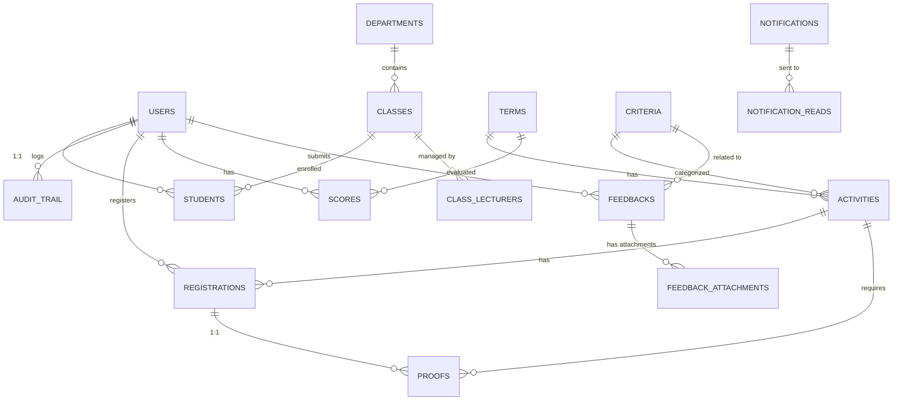
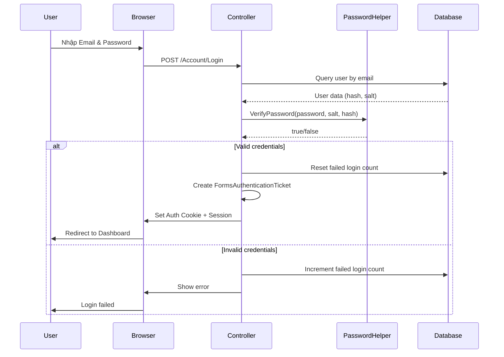

# HỆ THỐNG QUẢN LÝ ĐIỂM RÈN LUYỆN SINH VIÊN
## Tài liệu kỹ thuật toàn diện

---

## 📋 Mục lục

1. [Tổng quan hệ thống](#1-tổng-quan-hệ-thống)
2. [Công nghệ sử dụng](#2-công-nghệ-sử-dụng)
3. [Cấu trúc dự án](#3-cấu-trúc-dự-án)
4. [Cơ sở dữ liệu](#4-cơ-sở-dữ-liệu)
5. [Kiến trúc hệ thống](#5-kiến-trúc-hệ-thống)
6. [Tính năng bảo mật](#6-tính-năng-bảo-mật)
7. [Chức năng chính](#7-chức-năng-chính)
8. [Giao diện người dùng](#8-giao-diện-người-dùng)
9. [Hướng dẫn triển khai](#9-hướng-dẫn-triển-khai)

---

## 1. Tổng quan hệ thống

### 1.1 Giới thiệu

Hệ thống **Quản lý Điểm Rèn Luyện Sinh Viên** là một ứng dụng web được xây dựng để quản lý và theo dõi điểm rèn luyện của sinh viên trong các trường đại học. Hệ thống hỗ trợ đầy đủ quy trình từ đăng ký hoạt động, nộp minh chứng, duyệt điểm đến phúc khảo và thống kê.

### 1.2 Mục tiêu

- Số hóa quy trình quản lý điểm rèn luyện sinh viên
- Tự động hóa việc tính toán và phân loại điểm
- Cung cấp giao diện trực quan cho sinh viên, giảng viên và quản trị viên
- Đảm bảo tính toàn vẹn và bảo mật dữ liệu
- Hỗ trợ quy trình phúc khảo và phản hồi

### 1.3 Đối tượng sử dụng

- **Sinh viên (STUDENT)**: Đăng ký hoạt động, nộp minh chứng, xem điểm, phản hồi
- **Giảng viên (LECTURER)**: Quản lý lớp, duyệt điểm, xử lý phúc khảo
- **Quản trị viên (ADMIN)**: Quản lý toàn bộ hệ thống, người dùng, hoạt động

---

## 2. Công nghệ sử dụng

### 2.1 Backend Framework

#### ASP.NET MVC 5.3.0
- **Pattern**: Model-View-Controller
- **Framework Version**: .NET Framework 4.8
- **Language**: C# 
- **Runtime**: CLR 4.0

### 2.2 Database

#### Oracle Database
- **Provider**: Oracle.ManagedDataAccess 23.26.0
- **Connection Type**: Oracle Managed Data Access
- **Features**:
  - Stored Procedures & Functions
  - Triggers
  - GUID-based Primary Keys
  - Cascade Delete
  - Check Constraints
  - Foreign Key Relationships

### 2.3 Frontend Technologies

#### Client-side Libraries
- **jQuery 3.7.1**: DOM manipulation và AJAX
- **jQuery Validation 1.21.0**: Client-side validation
- **jQuery Unobtrusive Ajax 3.2.6**: AJAX operations
- **Knockout.js 3.5.1**: MVVM pattern cho UI binding
- **Bootstrap** (via Content): Responsive design

#### CSS & UI
- **Location**: `/Content` directory
- **Features**: Responsive layout, custom styling

### 2.4 Security & Encryption Libraries

- **System.Security.Cryptography**: Built-in .NET crypto
- **Forms Authentication**: ASP.NET Forms-based authentication
- **AES Encryption**: 256-bit symmetric encryption
- **SHA-256 Hashing**: Password hashing với salt + iteration

### 2.5 Additional Packages

```xml
<!-- Serialization & Data -->
- Newtonsoft.Json 13.0.4 (JSON serialization)
- Entity Framework 6.5.1 (ORM support)

<!-- Web API -->
- ASP.NET Web API 5.3.0
- ASP.NET Web API Client 6.0.0

<!-- Optimization -->
- Microsoft.AspNet.Web.Optimization 1.1.3
- WebGrease 1.6.0
- Antlr 3.5.0.2

<!-- Runtime Libraries -->
- System.Text.Json 10.0.0
- System.Buffers 4.6.1
- System.Memory 4.6.3
```

---

## 3. Cấu trúc dự án

### 3.1 Sơ đồ thư mục

```
QuanLyDiemRenLuyen/
│
├── Controllers/                # MVC Controllers
│   ├── AccountController.cs    # Xác thực & đăng ký
│   ├── Admin/                  # Controllers cho Admin
│   │   ├── AdminBaseController.cs
│   │   ├── DashboardController.cs
│   │   ├── UsersController.cs
│   │   ├── ClassesController.cs
│   │   ├── ActivitiesController.cs
│   │   ├── ScoresController.cs
│   │   ├── ProofsController.cs
│   │   ├── FeedbacksController.cs
│   │   └── ReviewRequestsController.cs
│   ├── Lecturer/              # Controllers cho Giảng viên
│   │   ├── LecturerBaseController.cs
│   │   ├── DashboardController.cs
│   │   └── ActivitiesController.cs
│   └── Student/               # Controllers cho Sinh viên
│       ├── StudentBaseController.cs
│       ├── DashboardController.cs
│       ├── ActivitiesController.cs
│       ├── ScoresController.cs
│       ├── FeedbacksController.cs
│       ├── NotificationsController.cs
│       └── ProfileController.cs
│
├── Models/                    # Data Models & ViewModels
│   ├── User.cs
│   ├── LoginViewModel.cs
│   ├── RegisterViewModel.cs
│   ├── ActivityViewModel.cs
│   ├── ScoreViewModel.cs
│   ├── ProofViewModel.cs
│   ├── ReviewRequestViewModel.cs
│   ├── ClassViewModel.cs
│   ├── StudentProfileViewModel.cs
│   ├── FeedbackViewModel (implied)
│   └── ...
│
├── Views/                     # Razor Views
│   ├── Account/              # Login, Register, ForgotPassword
│   ├── Admin/                # Admin views
│   ├── Lecturer/             # Lecturer views
│   ├── Student/              # Student views
│   └── Shared/               # Layout, partials
│
├── Helpers/                   # Helper Classes
│   ├── EncryptionHelper.cs   # Mã hóa AES
│   ├── PasswordHelper.cs     # Hash mật khẩu SHA-256
│   └── OracleDbHelper.cs     # Database utilities
│
├── Database/                  # Database Scripts
│   └── db.sql                # Schema & table definitions
│
├── Content/                   # CSS files
├── Scripts/                   # JavaScript files
├── App_Start/                # Application startup config
├── App_Data/                 # Application data
└── Web.config                # Configuration file
```

### 3.2 Các Controller chính

#### Account Controller
- Đăng nhập/Đăng xuất
- Đăng ký tài khoản mới
- Quên mật khẩu & Reset password
- Forms Authentication

#### Base Controllers
- **AdminBaseController**: Base class cho admin controllers với authorization
- **LecturerBaseController**: Base class cho lecturer controllers
- **StudentBaseController**: Base class cho student controllers

#### Feature Controllers
- **DashboardController**: Trang chủ theo từng role
- **ActivitiesController**: Quản lý hoạt động
- **ScoresController**: Quản lý điểm
- **ProofsController**: Quản lý minh chứng
- **FeedbacksController**: Phản hồi & phúc khảo
- **UsersController**: Quản lý người dùng
- **ClassesController**: Quản lý lớp học

---

## 4. Cơ sở dữ liệu

### 4.1 Sơ đồ quan hệ chính



### 4.2 Bảng dữ liệu chính

#### USERS - Người dùng
```sql
- MAND (PK)              : Mã người dùng
- EMAIL (UNIQUE)         : Email đăng nhập
- FULL_NAME              : Họ tên
- AVATAR_URL             : Link ảnh đại diện
- ROLE_NAME              : STUDENT/LECTURER/ADMIN
- PASSWORD_HASH          : Hash mật khẩu (SHA-256)
- PASSWORD_SALT          : Salt cho mật khẩu
- IS_ACTIVE              : Trạng thái kích hoạt
- FAILED_LOGIN_COUNT     : Số lần đăng nhập sai
- LOCKOUT_END_UTC        : Thời gian khóa tài khoản
- CREATED_AT             : Ngày tạo
- UPDATED_AT             : Ngày cập nhật
```

#### STUDENTS - Sinh viên
```sql
- USER_ID (PK, FK)       : Liên kết với USERS
- STUDENT_CODE (UNIQUE)  : Mã sinh viên
- CLASS_ID (FK)          : Lớp học
- DEPARTMENT_ID (FK)     : Khoa
- DATE_OF_BIRTH          : Ngày sinh
- GENDER                 : Giới tính (Nam/Nữ/Khác)
- PHONE                  : Số điện thoại
- ADDRESS                : Địa chỉ
```

#### ACTIVITIES - Hoạt động
```sql
- ID (PK)                : GUID
- TITLE                  : Tên hoạt động
- DESCRIPTION            : Mô tả chi tiết (CLOB)
- REQUIREMENTS           : Yêu cầu tham gia (CLOB)
- BENEFITS               : Lợi ích (CLOB)
- TERM_ID (FK)           : Học kỳ
- CRITERION_ID (FK)      : Tiêu chí điểm
- START_AT               : Thời gian bắt đầu
- END_AT                 : Thời gian kết thúc
- STATUS                 : OPEN/CLOSED/CANCELLED
- MAX_SEATS              : Số chỗ tối đa
- LOCATION               : Địa điểm
- POINTS                 : Điểm rèn luyện
- APPROVAL_STATUS        : PENDING/APPROVED/REJECTED
- APPROVED_BY (FK)       : Người duyệt
- ORGANIZER_ID (FK)      : Người tổ chức
```

#### SCORES - Điểm rèn luyện
```sql
- ID (PK)                : Auto-increment
- STUDENT_ID (FK)        : Sinh viên
- TERM_ID (FK)           : Học kỳ
- TOTAL_SCORE            : Tổng điểm (mặc định 70)
- CLASSIFICATION         : Xếp loại (Xuất sắc/Giỏi/Khá/...)
- STATUS                 : PROVISIONAL/APPROVED
- APPROVED_BY (FK)       : Người duyệt
- APPROVED_AT            : Thời gian duyệt
- CREATED_AT             : Ngày tạo
```

#### PROOFS - Minh chứng
```sql
- ID (PK)                : GUID
- REGISTRATION_ID (FK)   : Đăng ký hoạt động
- STUDENT_ID (FK)        : Sinh viên
- ACTIVITY_ID (FK)       : Hoạt động
- FILE_NAME              : Tên file
- STORED_PATH            : Đường dẫn lưu trữ
- CONTENT_TYPE           : MIME type
- FILE_SIZE              : Kích thước (bytes)
- SHA256_HEX             : Hash SHA-256 của file
- NOTE                   : Ghi chú
- STATUS                 : SUBMITTED/APPROVED/REJECTED
- CREATED_AT_UTC         : Thời gian nộp
- REVIEWED_AT_UTC        : Thời gian duyệt
```

#### FEEDBACKS - Phản hồi/Phúc khảo
```sql
- ID (PK)                : GUID
- STUDENT_ID (FK)        : Sinh viên
- TERM_ID (FK)           : Học kỳ
- CRITERION_ID (FK)      : Tiêu chí
- TITLE                  : Tiêu đề
- CONTENT                : Nội dung (CLOB)
- STATUS                 : DRAFT/SUBMITTED/RESPONDED/CLOSED
- RESPONSE               : Phản hồi (CLOB)
- CREATED_AT             : Ngày tạo
- RESPONDED_AT           : Ngày phản hồi
```

### 4.3 Các bảng hỗ trợ

- **DEPARTMENTS**: Khoa/Phòng ban
- **CLASSES**: Lớp học
- **TERMS**: Học kỳ/Năm học
- **CRITERIA**: Tiêu chí đánh giá điểm rèn luyện
- **REGISTRATIONS**: Đăng ký hoạt động
- **NOTIFICATIONS**: Thông báo hệ thống
- **NOTIFICATION_READS**: Trạng thái đọc thông báo
- **PASSWORD_RESET_TOKENS**: Token reset mật khẩu
- **AUDIT_TRAIL**: Nhật ký hoạt động hệ thống
- **CLASS_LECTURERS**: Giảng viên quản lý lớp
- **FEEDBACK_ATTACHMENTS**: File đính kèm phúc khảo

---

## 5. Kiến trúc hệ thống

### 5.1 Pattern MVC

Hệ thống áp dụng pattern **Model-View-Controller** của ASP.NET MVC:

```
┌─────────────┐
│   Browser   │
└──────┬──────┘
       │ HTTP Request
       ▼
┌─────────────────────────────┐
│      CONTROLLER             │
│  - Authentication           │
│  - Authorization            │
│  - Request Processing       │
│  - Business Logic           │
└──────┬──────────────┬───────┘
       │              │
       ▼              ▼
┌──────────┐   ┌────────────┐
│  MODEL   │   │    VIEW    │
│  - DTO   │   │  - Razor   │
│  - Data  │   │  - HTML    │
│  Access  │   │  - JS      │
└────┬─────┘   └────────────┘
     │
     ▼
┌─────────────────┐
│  ORACLE DB      │
│  - Tables       │
│  - Constraints  │
│  - Indexes      │
└─────────────────┘
```

### 5.2 Layers (Tầng)

#### Presentation Layer (Controllers + Views)
- Xử lý HTTP requests/responses
- Render HTML views
- Client-side validation

#### Business Logic Layer (Controllers + Helpers)
- Xử lý quy trình nghiệp vụ
- Validation rules
- Authorization & Authentication

#### Data Access Layer (Helpers)
- `OracleDbHelper`: Truy vấn database
- Parameterized queries (SQL injection prevention)
- Connection management

#### Database Layer
- Oracle Database
- Stored procedures (nếu có)
- Constraints & Triggers

### 5.3 Authentication Flow



---

## 6. Tính năng bảo mật

### 6.1 Mã hóa mật khẩu (Password Hashing)

#### Implementation: `PasswordHelper.cs`

**Thuật toán**: SHA-256 với Salt và Iteration

```csharp
// Quy trình:
1. Tạo Salt ngẫu nhiên (32 bytes) bằng RNGCryptoServiceProvider
2. Kết hợp Password + Salt
3. Hash bằng SHA-256
4. Lặp lại hash 1000 lần (iteration) để tăng độ bảo mật
5. Lưu Hash và Salt vào database
```

**Tính năng**:
- ✅ **Cryptographic Random Salt**: Sử dụng `RNGCryptoServiceProvider`
- ✅ **Salt riêng biệt**: Mỗi user có salt khác nhau
- ✅ **Iteration (1000 lần)**: Chống brute-force attacks
- ✅ **SHA-256**: Thuật toán hash an toàn

**Code example**:
```csharp
// Tạo salt
public static string GenerateSalt()
{
    byte[] saltBytes = new byte[32];
    using (var rng = new RNGCryptoServiceProvider())
    {
        rng.GetBytes(saltBytes);
    }
    return Convert.ToBase64String(saltBytes);
}

// Hash password
public static string HashPassword(string password, string salt)
{
    using (var sha256 = SHA256.Create())
    {
        string combined = password + salt;
        byte[] bytes = Encoding.UTF8.GetBytes(combined);
        
        byte[] hash = sha256.ComputeHash(bytes);
        for (int i = 0; i < 1000; i++)
        {
            hash = sha256.ComputeHash(hash);
        }
        
        return Convert.ToBase64String(hash);
    }
}
```

### 6.2 Mã hóa dữ liệu nhạy cảm (Symmetric Encryption)

#### Implementation: `EncryptionHelper.cs`

**Thuật toán**: AES-256 (Advanced Encryption Standard)

```csharp
// Đặc điểm:
- Key Size: 256 bits (32 bytes)
- Block Size: 128 bits
- Mode: CBC (Cipher Block Chaining)
- IV: Zero-initialized (demo only - production nên random)
```

**Tính năng**:
- ✅ **AES-256**: Chuẩn mã hóa đối xứng mạnh
- ✅ **Encrypt**: Mã hóa dữ liệu nhạy cảm
- ✅ **Decrypt**: Giải mã khi cần sử dụng
- ⚠️ **IV cố định**: Trong demo sử dụng IV zero, production nên random IV

**Use cases**:
- Mã hóa thông tin cá nhân
- Mã hóa dữ liệu nhạy cảm trong database
- Mã hóa file minh chứng (nếu cần)

### 6.3 Authentication & Authorization

#### Forms Authentication

**Cấu hình** (`Web.config`):
```xml
<authentication mode="Forms">
    <forms loginUrl="~/Account/Login" timeout="2880" />
</authentication>
```

**Tính năng**:
- ✅ **Encrypted Cookie**: Cookie xác thực được mã hóa
- ✅ **Timeout**: Tự động đăng xuất sau 2880 phút (2 ngày)
- ✅ **Sliding Expiration**: Gia hạn tự động khi active
- ✅ **Remember Me**: Tùy chọn ghi nhớ đăng nhập

**Implementation**:
```csharp
// Tạo authentication ticket
FormsAuthenticationTicket ticket = new FormsAuthenticationTicket(
    1,                          // Version
    mand,                       // User identifier
    DateTime.Now,               // Issue date
    DateTime.Now.AddMinutes(model.RememberMe ? 43200 : 30),
    model.RememberMe,           // Persistent
    roleName,                   // User data
    FormsAuthentication.FormsCookiePath
);

string encryptedTicket = FormsAuthentication.Encrypt(ticket);
HttpCookie authCookie = new HttpCookie(
    FormsAuthentication.FormsCookieName, 
    encryptedTicket
);
```

#### Role-Based Authorization

**Base Controllers với phân quyền**:

1. **AdminBaseController**
```csharp
[Authorize]
public abstract class AdminBaseController : Controller
{
    protected bool IsAdmin()
    {
        string roleName = Session["RoleName"]?.ToString();
        return roleName == "ADMIN" || roleName == "LECTURER";
    }
}
```

2. **StudentBaseController**
```csharp
[Authorize]
public abstract class StudentBaseController : Controller
{
    // Chỉ student được truy cập
}
```

3. **LecturerBaseController**
```csharp
[Authorize]
public abstract class LecturerBaseController : Controller
{
    // Chỉ lecturer được truy cập
}
```

### 6.4 Security Features khác

#### CSRF Protection
- ✅ **ValidateAntiForgeryToken**: Tất cả POST actions đều có
- ✅ **Anti-forgery tokens**: Ngăn chặn CSRF attacks

```csharp
[HttpPost]
[ValidateAntiForgeryToken]
public ActionResult Login(LoginViewModel model)
{
    // Protected against CSRF
}
```

#### SQL Injection Prevention
- ✅ **Parameterized Queries**: Tất cả query đều dùng parameters
- ✅ **OracleParameter**: Không concatenate SQL strings

```csharp
var parameters = new[]
{
    OracleDbHelper.CreateParameter("Email", OracleDbType.Varchar2, model.Email)
};
DataTable dt = OracleDbHelper.ExecuteQuery(query, parameters);
```

#### Account Lockout
- ✅ **Failed Login Tracking**: Đếm số lần đăng nhập sai
- ✅ **Auto Lockout**: Khóa tài khoản sau 5 lần sai
- ✅ **Lockout Duration**: 15 phút

```csharp
if (failedCount >= 5)
{
    lockoutEnd = DateTime.UtcNow.AddMinutes(15);
}
```

#### File Security (Minh chứng)
- ✅ **SHA-256 Hash**: Hash file để kiểm tra tính toàn vẹn
- ✅ **Content Type Validation**: Kiểm tra loại file
- ✅ **File Size Limit**: Giới hạn kích thước upload

#### Password Reset Security
- ✅ **Token-based**: Sử dụng token ngẫu nhiên 6 chữ số
- ✅ **Time-limited**: Token hết hạn sau 30 phút
- ✅ **One-time use**: Token chỉ dùng được 1 lần (IS_USED flag)

### 6.5 Audit Trail
- ✅ **Activity Logging**: Bảng AUDIT_TRAIL ghi nhận hoạt động
- ✅ **User Tracking**: Lưu WHO, WHAT, WHEN
- ✅ **IP & User Agent**: Ghi nhận thông tin client

---

## 7. Chức năng chính

### 7.1 Quản lý người dùng

#### Đăng ký tài khoản
- Tạo tài khoản mới (STUDENT/LECTURER/ADMIN)
- Validation email & mã người dùng unique
- Tự động tạo record STUDENT cho role STUDENT
- Hash mật khẩu với salt

#### Đăng nhập
- Xác thực email + password
- Kiểm tra account lockout
- Tạo Forms Authentication ticket
- Lưu thông tin vào Session
- Redirect theo role

#### Quên mật khẩu
- Tạo mã reset token (6 chữ số)
- Lưu token vào PASSWORD_RESET_TOKENS
- Gửi email (demo: hiển thị trực tiếp)
- Reset password với token

#### Quản lý profile
- Xem thông tin cá nhân
- Cập nhật thông tin
- Đổi mật khẩu
- Upload avatar

### 7.2 Quản lý hoạt động

#### Tạo hoạt động (Admin/Lecturer)
- Tạo hoạt động mới
- Phân loại theo tiêu chí (CRITERIA)
- Thiết lập điểm, thời gian, địa điểm
- Approval workflow

#### Đăng ký hoạt động (Student)
- Xem danh sách hoạt động
- Lọc theo trạng thái (UPCOMING/ONGOING/COMPLETED)
- Đăng ký tham gia
- Hủy đăng ký

#### Check-in (Admin/Lecturer)
- Điểm danh sinh viên tham gia
- Cập nhật trạng thái CHECKED_IN

### 7.3 Quản lý minh chứng

#### Nộp minh chứng (Student)
- Upload file minh chứng (PDF, images, etc.)
- Ghi chú kèm theo
- Tính SHA-256 hash của file
- Lưu thông tin file vào PROOFS

#### Duyệt minh chứng (Admin/Lecturer)
- Xem danh sách minh chứng chờ duyệt
- Download & xem file
- Approve/Reject
- Ghi chú phản hồi

### 7.4 Quản lý điểm

#### Tính điểm tự động
- Tổng hợp điểm từ các hoạt động đã approved
- Tính theo từng tiêu chí (CRITERIA)
- Cập nhật SCORES table

#### Xếp loại
- Xuất sắc: >= 90
- Giỏi: 80-89
- Khá: 65-79
- Trung bình: 50-64
- Yếu: < 50

#### Duyệt điểm (Lecturer)
- Xem điểm tạm tính (PROVISIONAL)
- Duyệt điểm chính thức (APPROVED)
- Cập nhật APPROVED_BY, APPROVED_AT

#### Xem điểm (Student)
- Xem điểm theo học kỳ
- Chi tiết điểm từng tiêu chí
- Lịch sử thay đổi điểm
- Thống kê điểm

### 7.5 Phúc khảo điểm

#### Gửi đơn phúc khảo (Student)
- Tạo feedback mới
- Chọn học kỳ, tiêu chí
- Ghi rõ nội dung phúc khảo
- Đính kèm file (FEEDBACK_ATTACHMENTS)

#### Xử lý phúc khảo (Lecturer/Admin)
- Xem danh sách đơn chờ xử lý
- Phản hồi nội dung
- Cập nhật điểm (nếu cần)
- Đóng đơn phúc khảo

### 7.6 Thông báo

#### Tạo thông báo (Admin/Lecturer)
- Gửi thông báo đến role (TARGET_ROLE)
- Gửi thông báo cá nhân (TO_USER_ID)
- Lưu vào NOTIFICATIONS

#### Xem thông báo (Student/Lecturer/Admin)
- Danh sách thông báo
- Đánh dấu đã đọc (NOTIFICATION_READS)
- Thống kê thông báo chưa đọc

### 7.7 Dashboard

#### Student Dashboard
- Tổng quan điểm rèn luyện
- Hoạt động sắp diễn ra (8 gần nhất)
- Thông báo mới
- Đơn phúc khảo đang xử lý

#### Lecturer Dashboard
- Lớp quản lý
- Số lượng sinh viên
- Điểm cần duyệt
- Phúc khảo chờ xử lý

#### Admin Dashboard
- Thống kê tổng quan
- Hoạt động hệ thống
- Người dùng mới
- Logs & Audit trail

---

## 8. Giao diện người dùng

### 8.1 Layout chung

#### Shared Layout (`Views/Shared/_Layout.cshtml`)
- Header với navigation
- User menu (profile, logout)
- Main content area
- Footer
- Responsive design

### 8.2 Views theo module

#### Account Views
- **Login.cshtml**: Form đăng nhập
- **Register.cshtml**: Form đăng ký
- **ForgotPassword.cshtml**: Quên mật khẩu
- **ResetPassword.cshtml**: Đặt lại mật khẩu

#### Student Views
- **Dashboard.cshtml**: Trang chủ sinh viên
- **Activities.cshtml**: Danh sách hoạt động
- **ActivityDetail.cshtml**: Chi tiết hoạt động
- **MyRegistrations.cshtml**: Hoạt động đã đăng ký
- **Scores.cshtml**: Điểm rèn luyện
- **ScoreDetail.cshtml**: Chi tiết điểm
- **Feedbacks.cshtml**: Danh sách phúc khảo
- **CreateFeedback.cshtml**: Tạo đơn phúc khảo
- **FeedbackDetail.cshtml**: Chi tiết phúc khảo
- **Profile.cshtml**: Thông tin cá nhân
- **EditProfile.cshtml**: Chỉnh sửa profile
- **ChangePassword.cshtml**: Đổi mật khẩu
- **Notifications.cshtml**: Thông báo
- **UploadProof.cshtml**: Nộp minh chứng

#### Admin Views
- **Dashboard.cshtml**: Trang chủ admin
- **Users/Index.cshtml**: Danh sách người dùng
- **Users/Create.cshtml**: Tạo người dùng
- **Users/Edit.cshtml**: Sửa người dùng
- **Classes/Index.cshtml**: Danh sách lớp
- **Classes/Create.cshtml**: Tạo lớp
- **Classes/Edit.cshtml**: Sửa lớp
- **Classes/Details.cshtml**: Chi tiết lớp
- **Activities.cshtml**: Quản lý hoạt động
- **ApproveActivity.cshtml**: Duyệt hoạt động
- **ViewRegistrations.cshtml**: Xem đăng ký
- **Proofs/Index.cshtml**: Danh sách minh chứng
- **Proofs/Detail.cshtml**: Chi tiết minh chứng
- **Feedbacks/Index.cshtml**: Danh sách phúc khảo
- **Feedbacks/Detail.cshtml**: Chi tiết phúc khảo
- **ClassScores.cshtml**: Điểm theo lớp
- **ApproveScores.cshtml**: Duyệt điểm
- **ReviewRequests.cshtml**: Đơn phúc khảo

#### Lecturer Views
- **Dashboard/Dashboard.cshtml**: Trang chủ giảng viên
- **Activities/Index.cshtml**: Hoạt động quản lý

### 8.3 UI Components

#### Client-side Technologies
- **jQuery**: DOM manipulation, AJAX calls
- **jQuery Validation**: Form validation
- **Knockout.js**: Data binding
- **Bootstrap**: Responsive grid & components

#### Common UI Patterns
- Tables với pagination
- Search & filter forms
- Modal dialogs
- Alert messages (success, error, info)
- Breadcrumbs
- Cards/Panels

---

## 9. Hướng dẫn triển khai

### 9.1 Yêu cầu hệ thống

#### Server Requirements
- **OS**: Windows Server 2012 R2 hoặc mới hơn
- **IIS**: Version 8.0+
- **.NET Framework**: 4.8
- **Oracle Database**: 11g hoặc mới hơn

#### Development Requirements
- **Visual Studio**: 2019 hoặc mới hơn
- **SQL Developer** (cho Oracle)
- **Web browser** hiện đại (Chrome, Firefox, Edge)

### 9.2 Cài đặt Database

#### Bước 1: Tạo User Oracle
```sql
-- Tạo user mới
CREATE USER QLDiemRenLuyen IDENTIFIED BY drl123;

-- Cấp quyền
GRANT CONNECT, RESOURCE TO QLDiemRenLuyen;
GRANT CREATE SESSION TO QLDiemRenLuyen;
GRANT UNLIMITED TABLESPACE TO QLDiemRenLuyen;
```

#### Bước 2: Chạy Database Script
```bash
# Sử dụng SQL*Plus hoặc SQL Developer
sqlplus QLDiemRenLuyen/drl123@localhost:1521/orcl

# Chạy script tạo bảng
@Database/db.sql
```

#### Bước 3: Insert dữ liệu mẫu (nếu cần)
- Tạo admin account mặc định
- Tạo departments, classes mẫu
- Tạo criteria (tiêu chí đánh giá)

### 9.3 Cấu hình ứng dụng

#### Bước 1: Clone repository
```bash
git clone https://github.com/yourusername/QuanLyDiemRenLuyen.git
cd QuanLyDiemRenLuyen
```

#### Bước 2: Restore NuGet packages
```bash
# Trong Visual Studio
Tools > NuGet Package Manager > Restore NuGet Packages
```

#### Bước 3: Cấu hình kết nối Database

Sửa file `Web.config`:
```xml
<connectionStrings>
    <add name="OracleConnection"
         connectionString="Data Source=localhost:1521/orcl;User Id=QLDiemRenLuyen;Password=drl123;"
         providerName="Oracle.ManagedDataAccess.Client" />
</connectionStrings>
```

#### Bước 4: Build solution
```bash
# Trong Visual Studio
Build > Build Solution (Ctrl+Shift+B)
```

### 9.4 Deploy lên IIS

#### Bước 1: Publish từ Visual Studio
1. Right-click project > **Publish**
2. Chọn **Folder** target
3. Chọn đường dẫn publish
4. Click **Publish**

#### Bước 2: Tạo Application Pool
1. Mở **IIS Manager**
2. Application Pools > Add Application Pool
3. Name: `QuanLyDiemRenLuyenPool`
4. .NET CLR version: `v4.0`
5. Managed pipeline mode: `Integrated`

#### Bước 3: Tạo Website
1. Sites > Add Website
2. Site name: `QuanLyDiemRenLuyen`
3. Application pool: `QuanLyDiemRenLuyenPool`
4. Physical path: Đường dẫn folder published
5. Binding: HTTP, port 80 hoặc tùy chỉnh

#### Bước 4: Cấu hình permissions
- Cấp quyền **Read** cho IIS_IUSRS
- Cấp quyền **Write** cho App_Data (nếu có)

### 9.5 Testing

#### Test cases cơ bản
1. **Login**: Kiểm tra đăng nhập với các role khác nhau
2. **Register**: Tạo tài khoản mới
3. **Activities**: Tạo và đăng ký hoạt động
4. **Scores**: Tính điểm và duyệt điểm
5. **Proofs**: Upload minh chứng
6. **Feedbacks**: Tạo và xử lý phúc khảo

#### Performance testing
- Load testing với nhiều users đồng thời
- Database query performance
- File upload performance

---

## 10. Tóm tắt các tính năng bảo mật

### ✅ Đã triển khai

| Tính năng | Loại | Mô tả |
|-----------|------|-------|
| **Password Hashing** | Mã hóa bất đối xứng | SHA-256 + Salt + 1000 iterations |
| **AES Encryption** | Mã hóa đối xứng | AES-256 cho dữ liệu nhạy cảm |
| **Forms Authentication** | Xác thực | Encrypted cookie-based authentication |
| **CSRF Protection** | Web Security | ValidateAntiForgeryToken trên tất cả POST |
| **SQL Injection Prevention** | Database Security | Parameterized queries |
| **Account Lockout** | Brute-force Protection | Khóa sau 5 lần đăng nhập sai |
| **Role-based Authorization** | Phân quyền | ADMIN/LECTURER/STUDENT |
| **Session Management** | State Management | Server-side session với timeout |
| **File Integrity** | Data Integrity | SHA-256 hash cho uploaded files |
| **Password Reset** | Account Recovery | Token-based với expiration |
| **Audit Trail** | Logging | Ghi nhật ký hoạt động hệ thống |

### ⚠️ Khuyến nghị cải thiện

1. **Random IV cho AES**: Hiện tại dùng IV zero (chỉ demo)
2. **Password Complexity Rules**: Thêm yêu cầu mật khẩu mạnh
3. **Email Verification**: Xác thực email khi đăng ký
4. **2FA**: Thêm xác thực 2 yếu tố
5. **Rate Limiting**: Giới hạn request để chống DDoS
6. **Content Security Policy**: Thêm CSP headers
7. **HTTPS Only**: Force HTTPS trong production

---

## 11. Kết luận

Hệ thống **Quản lý Điểm Rèn Luyện Sinh Viên** là một ứng dụng web hoàn chỉnh được xây dựng trên nền tảng **ASP.NET MVC 5** với **Oracle Database**, cung cấp đầy đủ các tính năng quản lý điểm rèn luyện từ đăng ký hoạt động, nộp minh chứng, duyệt điểm đến phúc khảo.

### Điểm mạnh của hệ thống:

✅ **Kiến trúc rõ ràng**: MVC pattern, phân tầng tốt  
✅ **Bảo mật cao**: Encryption, hashing, authorization  
✅ **Database mạnh mẽ**: Oracle với constraints đầy đủ  
✅ **Phân quyền rõ ràng**: 3 roles với base controllers  
✅ **Audit trail**: Theo dõi hoạt động hệ thống  
✅ **UI thân thiện**: Responsive, validation tốt  

### Phù hợp cho:
- Sinh viên mới học ASP.NET MVC
- Developer cần tham khảo kiến trúc MVC với Oracle
- Đồ án tốt nghiệp ngành CNTT
- Hệ thống quản lý điểm thực tế tại trường đại học

---

**Tài liệu được tạo bởi**: AI Assistant  
**Ngày**: 2025-12-02  
**Version**: 1.0  
**Repository**: d:\DevTools\projects\QuanLyDiemRenLuyen
